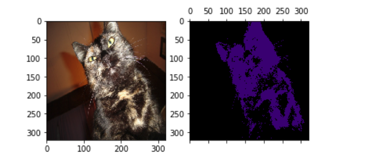

## Easy to Understand: Pytorch implementation of "Seed, Expand and Constrain: Three Principles for Weakly-Supervised Image Segmentation."



This is the pytorch implementation of 'Seed, Expand and Constrain: Three Principles for Weakly-Supervised Image Segmentation' (<a href="https://arxiv.org/abs/1603.06098">Paper</a>).

You can train the segmentation network in **your datasets**.

My contributions are summarized as follows.

1. I clarified the way to get localization cues. (See "/weak-localization/get_cues.py")
2. Some people reported that they had some errors in installing CRF Python wrapper. So, I replaced it with <a href="https://github.com/lucasb-eyer/pydensecrf">pydensecrf</a>.
3. I modified previous codes in order to train segmentation network in not only PASACL VOC2012 but also our own datasets.

### Assumed Dataset Directory Structure

```
dataset/train
├── 0 (label 0)
│   └── 1.png
├── 1 (label 1)
│   └── 1.png
└── 2 (label 2)
    └── 1.png
```

### Procedure

##### Install Required Packages

```
$ pip install -r requirements.txt
```

##### Train Network for localization foreground class cues

```
$ cd weak-localization/foreground
$ python train.py
```

##### Train Network for localization background cues

```
$ cd weak-localization/background
$ python train.py
```

##### Generate Localization Cues File

```
$ cd weak-localization
$ python get_cues.py path_to_dataset_root
```

##### Train Network for weakly supervised segmentation

```
$ python inference.py --height 240 --width 320 --num_class 4 --image ./dataset/train/0/1.jpg --weight ./segmentation-weights.pth
```

### Acknowledgement

The most part of implementation in pylayers.py is heavily dependent on Previous implementation (<a href="https://github.com/TKKim93/sec.pytorch">Code</a>)

